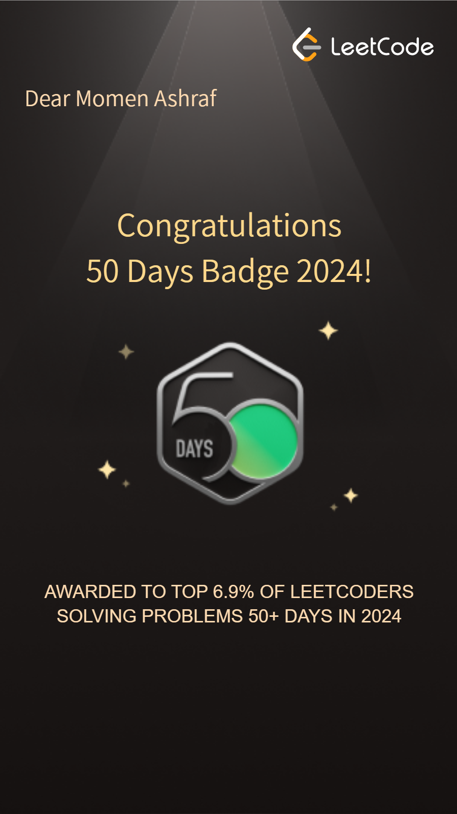

# LeetCode Solutions 🧠

My personal solutions to LeetCode problems, covering a range of topics and difficulty levels.

## 🏅 Badges

  
  
  

## 👤 Author
**Momen Ashraf**
- LeetCode: [leetcode.com/u/Momen-Ashraf](https://leetcode.com/u/Momen-Ashraf/)
- GitHub: [github.com/Momen-Ashraf](https://github.com/Momen-Ashraf)
- LinkedIn: [linkedin.com/in/momen-ashraf-](https://www.linkedin.com/in/momen-ashraf-)

## 🛠️ Languages Used
- C++
- Python
- SQL
- Pandas

## 🚀 How It Works
Solutions are automatically pushed to this repository using the [LeetPush](https://github.com/husamahmud/LeetPush) browser extension.

Happy coding! 🚀

---
*Powered by [LeetPush](https://github.com/husamahmud/LeetPush) — created by [Tut](https://github.com/TutTrue) & [Hüsam](https://github.com/husamahmud)*
